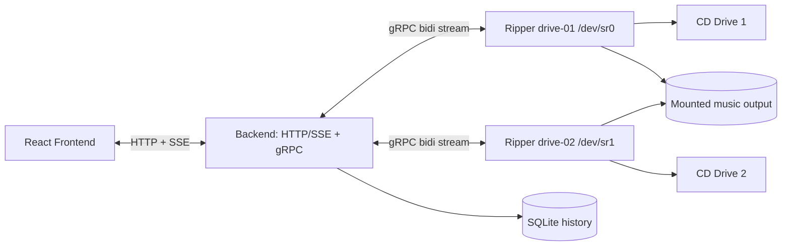

# Rippymcripface

Self-hosted automatic audio-CD ripping with `abcde`, one Docker ripper container per optical drive, a Node/TypeScript backend, and a React dashboard.



## Services

- `frontend`: React + TypeScript UI at `http://localhost:3000`, including live drive state, album art lookup, track lists, progress, logs, and history.
- `backend`: Node.js + TypeScript coordinator. Exposes HTTP API/SSE on `:8080`, gRPC on `:50051`, persists job history in SQLite.
- `ripper`: Node.js + TypeScript drive agent. Each instance owns exactly one device (`/dev/sr0`, `/dev/sr1`), watches udev, runs `abcde`, streams events/logs to backend.

## Directory structure

```text
apps/frontend   React dashboard
apps/backend    HTTP/SSE API, gRPC server, state, SQLite persistence
apps/ripper     udev monitor, abcde process manager, gRPC client
packages/proto  rippy.proto and proto loader helper
packages/shared shared domain types and state-machine tests
packages/config environment parsing
Dockerfiles     under each app
docker/         example abcde config
compose.yaml    local self-hosted stack
```

## gRPC design

`packages/proto/src/rippy.proto` defines `RipperService.Connect`, a bidirectional stream.

Ripper-to-backend messages include:

- `RipperHello`
- `Heartbeat`
- `DriveState`
- `DiscEvent`
- `RipEvent`
- `RipLog`

Backend-to-ripper commands include:

- `StartRip`
- `CancelRip`
- `EjectDisc`
- `RefreshDisc`

Rippers reconnect automatically if the backend is unavailable or restarts. The backend marks disconnected rippers offline without deleting state/history.

## Host requirements

Linux host with:

- Docker Compose
- physical optical drives such as `/dev/sr0`, `/dev/sr1`
- host udev running normally
- permission for Docker to pass optical devices into containers

## Docker permissions and udev

The default compose grants each ripper its optical block device and matching SCSI generic device:

```yaml
devices:
  - /dev/sr0:/dev/sr0
  - /dev/sg0:/dev/sg0
volumes:
  - /run/udev:/run/udev:ro
  - ./data/music:/music
```

The `/dev/sgX` mapping is important for reliable `cdparanoia`/`abcde` reads on many drives.

The container does **not** run `udevd`. It runs `udevadm monitor` against host udev data and has a small polling fallback for resilience. `privileged: true` is intentionally not enabled by default.

If your distro blocks access, check group/device permissions first. Some unusual USB/SCSI setups may require adding related generic devices (for example `/dev/sg*`) or relaxing cgroup/device rules.

## Configuring drives

Each ripper needs stable environment:

```env
RIPPER_ID=drive-01
DRIVE_DEVICE=/dev/sr0
AUTO_RIP=true
OUTPUT_DIR=/music
OUTPUT_FORMAT=flac
BACKEND_GRPC_ADDR=backend:50051
```

## Adding another optical drive

Uncomment `ripper-sr1` in `compose.yaml`, adjust:

```yaml
environment:
  RIPPER_ID: drive-02
  DRIVE_DEVICE: /dev/sr1
devices:
  - /dev/sr1:/dev/sr1
```

Run:

```bash
docker compose --profile sr1 up -d --build
```

`ripper-sr0` is enabled by default; `ripper-sr1` is production-ready behind the `sr1` profile so hosts with only one drive can still run plain `docker compose up -d`. Each drive rips independently and concurrently because each has its own ripper container/process.

## abcde configuration

The ripper invokes `abcde` with process args, not shell strings. The audio pipeline follows ARM's abcde-based approach while keeping Rippymcripface in charge of job state, validation, publishing, and ejects.

For each job the ripper creates an isolated work directory under `/work/<job-id>` containing `abcde.conf`, WAV/temp data, staging output, and logs. abcde runs in noninteractive verbose mode:

```bash
abcde -N -V -d /dev/sr0 -c /work/<job-id>/abcde.conf
```

Generated config includes MusicBrainz, cdparanoia, FLAC verification, padded tracks, and no abcde eject handling:

```conf
CDDBMETHOD=musicbrainz
INTERACTIVE=n
CDROMREADERSYNTAX=cdparanoia
OUTPUTTYPE=flac
FLACENCODERSYNTAX=flac
CDPARANOIAOPTS="-z=100 -X"
FLACOPTS="-8 -V"
ACTIONS=musicbrainz,read,encode,tag,move,clean
```

abcde writes to job staging first. The app validates abcde exit status, expected track count, FLAC count, and `flac -t` before atomically publishing to `/music`. Existing library paths are never overwritten.

Config knobs:

- `OUTPUT_DIR` default `/music`
- `OUTPUT_FORMAT` default `flac`
- `ABCDE_CONFIG` optional path, e.g. `/etc/abcde.conf`

See `docker/abcde.conf.example`. To mount it:

```yaml
volumes:
  - ./docker/abcde.conf.example:/etc/abcde.conf:ro
environment:
  ABCDE_CONFIG: /etc/abcde.conf
```

## Starting the stack

```bash
cp .env.example .env
docker compose up -d
```

The compose file references CI-published images by default:

```env
IMAGE_PREFIX=ghcr.io/laurinium/discops
IMAGE_TAG=latest
```

For local development builds instead:

```bash
npm install
npm test
npm run build
docker compose up -d --build
```

Open `http://localhost:3000`. Extra drives are enabled with profiles, for example `COMPOSE_PROFILES=sr1,sr2 docker compose up -d`.

Output FLAC files are written to `./data/music`. Backend SQLite data is in `./data/backend`.

## HTTP API

OpenAPI docs are served by the backend:

- `GET /docs` interactive API reference
- `GET /openapi.json` OpenAPI 3.1 document

Endpoints:

- `GET /healthz`
- `GET /api/state`
- `GET /api/events` (SSE)
- `POST /api/rippers/:ripperId/startRip`
- `POST /api/rippers/:ripperId/cancelRip`
- `POST /api/rippers/:ripperId/ejectDisc` (toggles tray: eject when closed, close when open)
- `POST /api/rippers/:ripperId/refreshDisc`
- `POST /api/rippers/:ripperId/resetDrive` (dangerous SCSI device reset; UI requires confirmation)

## Reliability behavior

Implemented safeguards:

- backend/ripper reconnect handling
- disconnected rippers become offline, state/history retained
- one `abcde` process max per ripper
- duplicate udev event debounce
- fallback polling when udev misses events
- safe child-process spawning with argument arrays
- SIGTERM/SIGINT cancellation of active `abcde`
- raw stdout/stderr streamed to backend/UI
- SQLite persisted completed/failed/cancelled history

## Troubleshooting

Check devices:

```bash
ls -l /dev/sr* /dev/sg* 2>/dev/null
udevadm monitor --udev --subsystem-match=block
```

Check container logs:

```bash
docker compose logs -f backend
docker compose logs -f ripper-sr0
```

If insertion is not detected:

1. verify `/run/udev` is mounted read-only into the ripper
2. verify the correct `/dev/srX` is mapped
3. check whether your drive also needs `/dev/sgX`
4. verify the matching `/dev/sgX` is mapped (`lsscsi -g` is useful)
5. set `UDEV_MONITOR=false` temporarily to rely on polling fallback

If `abcde` fails metadata lookup, ripping may still work depending on your abcde config. Customize `/etc/abcde.conf` for your preferred metadata/musicbrainz setup.

## Development commands

```bash
npm install
npm run proto:generate
npm run build
npm test
npm run lint
npm run dev -w @rippy/backend
npm run dev -w @rippy/ripper
npm run dev -w @rippy/frontend
```

## Current implementation notes

The vertical slice is intentionally boring and framework-light. Metadata extraction is currently limited to what `abcde` logs expose; future improvements can parse `abcde`/CDDB output more deeply and populate artist/album earlier in the state machine.
